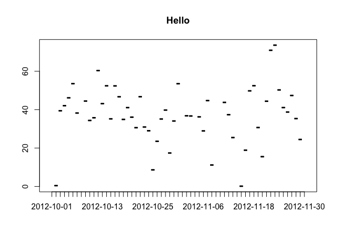
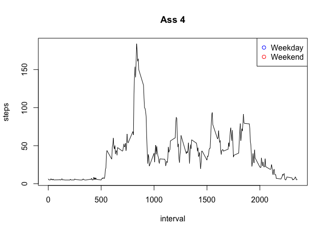

# Reproducible Research: Peer Assessment 1


## Loading and preprocessing the data

```r
  data <- read.csv("activity.csv")
  meanStepsPerInterval = aggregate(steps ~ interval, data, sum) 
  totalStepsPerDay =  aggregate(steps ~ date, data, sum)
  medianStepsPerDay = aggregate(steps ~ date, data, median)
  meanStepsPerDay = aggregate(steps ~ date, data, mean)
```

## What is mean total number of steps taken per day?


```r
    with(totalStepsPerDay, plot(date, steps, main="Mean total number of steps taken per day", type="l", pch=12))
```


## What is the average daily activity pattern?


```r
  with(meanStepsPerDay, plot(
    date, steps, main = "Hello", type = "l", pch = 12
  ))
```



## Imputing missing values

```r
  #Replace NA data with the average of all Steps
  data2 <- data
  data2$steps[which(is.na(data2$steps))] <- mean(data2$steps, na.rm=TRUE)
  head(data2, n=20)
```

```
##      steps       date interval
## 1  37.3826 2012-10-01        0
## 2  37.3826 2012-10-01        5
## 3  37.3826 2012-10-01       10
## 4  37.3826 2012-10-01       15
## 5  37.3826 2012-10-01       20
## 6  37.3826 2012-10-01       25
## 7  37.3826 2012-10-01       30
## 8  37.3826 2012-10-01       35
## 9  37.3826 2012-10-01       40
## 10 37.3826 2012-10-01       45
## 11 37.3826 2012-10-01       50
## 12 37.3826 2012-10-01       55
## 13 37.3826 2012-10-01      100
## 14 37.3826 2012-10-01      105
## 15 37.3826 2012-10-01      110
## 16 37.3826 2012-10-01      115
## 17 37.3826 2012-10-01      120
## 18 37.3826 2012-10-01      125
## 19 37.3826 2012-10-01      130
## 20 37.3826 2012-10-01      135
```
## Are there differences in activity patterns between weekdays and weekends?

```r
  #Replace NA data with the average of all Steps
  #Create new data frame with new data (data2)
  data2 <- data
  data2$steps[which(is.na(data2$steps))] <-
    mean(data2$steps, na.rm = TRUE)
  
  #Calculate new measurments based on new data frame (data2)
  meanStepsPerInterval2 = aggregate(steps ~ interval, data2, sum)
  totalStepsPerDay2 =  aggregate(steps ~ date, data2, sum)
  medianStepsPerDay2 = aggregate(steps ~ date, data2, median)
  meanStepsPerDay2 = aggregate(steps ~ date, data2, mean)
  
  #Plot new steps per day
  #with(totalStepsPerDay2, plot(
   # date, steps, main = "Hello", type = "h", pch = 12
 #  ))
  
  day = weekdays(as.Date(data2$date))
  
  #Add new column and calculated weekdays and weekends
  data2$day = weekdays(as.Date(data2$date))
  data2["daytype"] <- NA
  data2$daytype[which(data2$day == "Saturday" |
                        data2$day == "Sunday")] <- "weekend"
  data2$daytype[which(
    data2$day == "Monday" |
      data2$day == "Tuesday" |
      data2$day == "Wednesday" |
      data2$day == "Thursday" | data2$day == "Friday"
  )] <- "weekday"
  
  #Calculate and plot steps per day in relation to weekend or weekday
  meanStepsPerDay3 = aggregate(steps ~ interval, data2, mean)
  with(meanStepsPerDay3, plot(interval, steps, main = "Ass 4", type = "l"))
  with(
    subset(meanStepsPerDay3, data2$daytype == "weekend"), points(interval, steps, col =
                                                                   "blue", type = "l")
  )
  with(
    subset(meanStepsPerDay3, data2$daytype == "weekday"), points(interval,steps, col =
                                                                   "red", type = "l")
  )
  legend(
    "topright", pch = 1, col = c("blue", "red"), legend = c("Weekday", "Weekend")
  )
```


  
  
